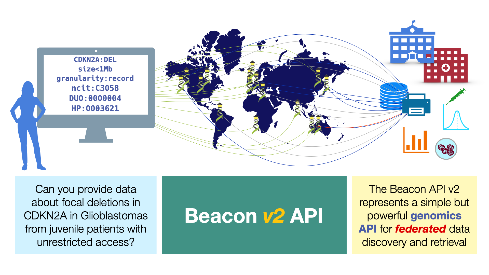

At its Spring 2022 GA4GH Connect stakeholder meeting in Montreal (and online...) the
steering committee of the Global Alliance for Genomics and Health ([GA4GH](http://ga4gh.org))
approved the major "v2" update of the Beacon protocol as official GA4GH standard.

<!--more-->

<figure markdown>
  { width="750" }
  <figcaption>A visualization of some Beacon v2 concepts (from [docs.genomebeacons.org](http://docs.genomebeacons.org)</figcaption>
</figure>

Beacon v2 represents a major revision of the original concept, with a completely new code base
and a focus on high flexibility through its modular design. The Beacon code base includes
both the **framework** - _i.e._ the specific ation for the general formats & components of requests and responses
to a Beacon v2 server - as well as the default **model** which provides schemas for the representation
of data from different domains (e.g. genomic variations, biosamples) as well as query parameters.

With respect to the exchange of information about structural genome variation data, Beacon v2
explicitely allows for CNV queries either through simple genomic "Range Queries" as well as "Bracket Queries",
for which individual genomic brackets for start and end positions can be specified. Please refer to the
[documentation](http://docs.genomebeacons.org/variant-queries/#beacon-bracket-queries) for further details.

Also included in the documentation is a comparison of the "variant type" use across different specifications,
e.g. how CNVs (and their subtypes) are represented in EFO, VCF, VRS ... and in Beacon queries. This part
of the documentation (and the Beacon specification parts) has been heavily influenced by contributions
from several members of the hCNV communty. Please watch the space there for updates - and consider
to contribute!

!!! Note "Citation"

    **Beacon v2 and Beacon Networks: a "lingua franca" for federated data discovery in biomedical genomics, and beyond.**
    Jordi Rambla, Michael Baudis, Tim Beck, Lauren A. Fromont, Arcadi Navarro, Manuel Rueda, Gary Saunders, Babita Singh, J.Dylan Spalding, Juha Tornroos, Claudia Vasallo, Colin D.Veal, Anthony J.Brookes. _Human Mutation_ (2022) [DOI](https://doi.org/10.1002/humu.24369).

